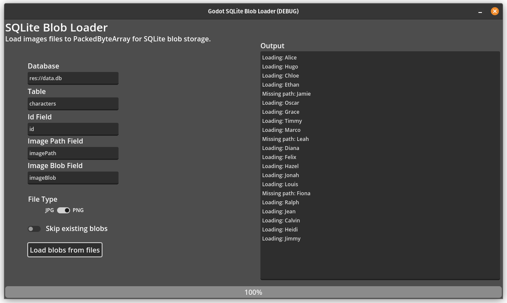

# Godot SQLite Blob Loader
Godot scene helper for loading image files to [PackedByteArray](https://docs.godotengine.org/en/stable/classes/class_packedbytearray.html) blobs for storage in a SQLite database.

This project relies on the [godot-sqlite](https://github.com/2shady4u/godot-sqlite) addon. This project excludes the addon binaries, so please install it before using this project.

# Table Structure

This application is dependent on a SQLite database table with the following minimum fields:
- `id` - INTEGER, cell identifier  
- `imagePath` - TEXT, cell containing the image file path  
- `imageBlob` - BLOB, cell containing the image blob  

All field names may be configured in the application.

## Example

|id (int, nn, pk)|name (text)|imagePath (text)|imageBlob (blob)
|--|--|--|--|
|1|Rob|res://images/subfolder/purple.png|*BLOB*|
|2|Jimmy|res://images/subfolder/red.png|*BLOB*|
|3|Alex|null|null|

Please open `data.db` for more information.

&nbsp;
